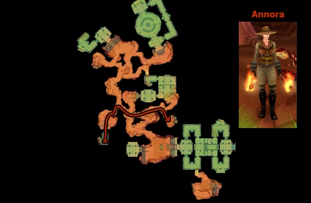
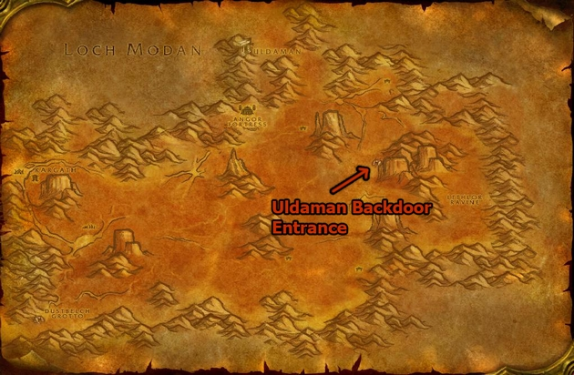

# WoW Classic Enchanting Leveling Guide 1-300

A comprehensive guide to leveling the Enchanting profession from 1 to 300 in WoW Classic, including trainer locations, rod creation, and strategies to navigate material costs.

## 📜 Introduction

Enchanting is a unique and valuable profession in WoW Classic, allowing you to enhance gear with powerful stats and effects. It's famously expensive to level but pairs perfectly with **Tailoring**, as you can disenchant the items you craft. This guide details the most efficient leveling path.

---

## 🧭 Trainers and Skill Tiers

You must find specific trainers to advance your Enchanting rank. **Rod recipes are crucial milestones** for learning higher-tier enchants.

| Skill Tier | Required Skill | Required Character Level | Key Trainer Locations |
| :--- | :--- | :--- | :--- |
| **Apprentice** | 1 | 5 | City trainers (e.g., **Betty Quin** in Stormwind, **Jhag** in Orgrimmar). |
| **Journeyman** | 50 | 10 | **Lucan Cordell** (Stormwind), **Gimble Thistlefuzz** (Ironforge), **Godan** (Orgrimmar). |
| **Expert** | 125 | 20 | **Kitta Firewind** (Tower of Azora, Elwynn Forest) - **Alliance only**. **Hgarth** (Sun Rock Retreat, Stonetalon Mountains) - **Horde only**. |
| **Artisan** | 200 | 35 | **Annora** (Inside **Uldaman** instance, Badlands) - **The only trainer in the game**. |

**Crucial Details:**
*   **Uldaman is Mandatory:** To advance past 225, you **must** find **Annora** deep inside the Uldaman dungeon. She is the sole source of Artisan training and critical recipes.
*   **Rod Progression:** You must craft a new enchanted rod at skill levels 2, 100, 155, 200, and 295 to access higher-level recipes.

---

## 📈 Efficient Leveling Path (1-300)

This path balances cost and speed. **Always check Auction House (AH) prices** for essence and dust, as switching to cheaper materials can save significant gold.

### **1 - 50 (Apprentice)**
*   **1-2:** **Runed Copper Rod** (1 Copper Rod, 1 Strange Dust, 1 Lesser Magic Essence).
    *   **Tip:** Buy the **Copper Rod** from a Trade Supplies vendor near your trainer, not the AH.
*   **2-50:** **Enchant Bracer - Minor Health** (1 Strange Dust).
    *   **Alternative:** Disenchant green quality items you find while leveling.

### **50 - 110 (Journeyman)**
*   **50-90:** **Enchant Bracer - Minor Health** (1 Strange Dust). Continue if Strange Dust is cheap.
*   **90-100:** **Enchant Bracer - Minor Stamina** (3 Strange Dust).
*   **100-101:** **Runed Silver Rod** (1 Silver Rod, 6 Strange Dust, 3 Greater Magic Essence, 1 Shadowgem).
*   **101-110:** **Greater Magic Wand** (1 Simple Wood, 1 Greater Magic Essence). *Wands can be sold to recoup costs.*

### **110 - 135 (The First Recipe Hunt)**
*   **Primary Path:** Purchase **Formula: Enchant Cloak - Minor Agility** from a limited-supply vendor:
    *   **Alliance:** **Dalria** in Ashenvale.
    *   **Horde:** **Kulwia** in Stonetalon Mountains.
    *   **Craft 110-135:** **Enchant Cloak - Minor Agility** (1 Lesser Astral Essence).
*   **Alternative (if essences are expensive):** **Enchant 2H Weapon - Minor Impact** (4 Strange Dust, 1 Small Glimmering Shard).

### **135 - 185 (Expert)**
*   **135-155:** **Enchant Bracer - Lesser Stamina** (2 Soul Dust).
*   **155-156:** **Runed Golden Rod** (1 Golden Rod, 1 Iridescent Pearl, 2 Greater Astral Essence, 2 Soul Dust).
*   **156-185:** **Enchant Bracer - Lesser Stamina** (2 Soul Dust).
    *   **Alternative at 165:** **Enchant Bracer - Spirit** (1 Lesser Mystic Essence) if essences are cheaper than dust.

### **185 - 225 (Pushing to Artisan)**
*   **185-200:** **Enchant Bracer - Strength** (1 Vision Dust).
*   **200-201:** **Runed Truesilver Rod** (1 Truesilver Rod, 1 Black Pearl, 2 Greater Mystic Essence, 2 Vision Dust).
*   **201-220:** **Enchant Bracer - Strength** (1 Vision Dust). Buy extra, as it turns yellow.
*   **220-225:** **Enchant Cloak - Greater Defense** (3 Vision Dust).

### **225 - 300 (Artisan - The Final Grind)**
**⚠️ Prepare Before Entering Uldaman!** Bring **11.79 Gold** to learn all recipes from Annora and enough **Vision Dust (~200)** to reach 250.

*   **225-250 (in Uldaman with Annora):**
    *   225-230: **Enchant Gloves - Agility** (1 Lesser Nether Essence, 1 Vision Dust).
    *   230-235: **Enchant Boots - Stamina** (5 Vision Dust).
    *   235-250: **Enchant Chest - Superior Health** (6 Vision Dust).
*   **250-265:** **Lesser Mana Oil** (3 Dream Dust, 2 Purple Lotus, 1 Crystal Vial). Buy formula from **Kania** in Silithus.
    *   **SoD/Alternative:** **Enchant Bracer - Greater Strength** (2 Dream Dust, 1 Greater Nether Essence) if the oil vendor is unavailable.
*   **265-294:** **Enchant Shield - Greater Stamina** (1 Dream Dust). Formula is sold by **Daniel Bartlett** (Undercity) or **Mythrin'dir** (Darnassus). **⚠️ It is Bind on Pickup and limited supply!**
*   **294-295:** **Runed Arcanite Rod** (1 Arcanite Rod, 1 Golden Pearl, 10 Illusion Dust, 4 Greater Eternal Essence, 4 Small Brilliant Shard, 2 Large Brilliant Shard). Buy formula in Moonglade.
*   **295-300:** **Enchant Cloak - Superior Defense** (8 Illusion Dust). Buy the final formula in Moonglade.

---

## ⚠️ Critical Warnings & Pro Tips

*   **Uldaman is Not Soloable at 35.** You need a party or a high-level friend to escort you to **Annora**. She only spawns after clearing the mobs in her chamber.
*   **The 265-294 Wall:** The **Enchant Shield - Greater Stamina** formula is a major bottleneck. It's **Bind on Pickup**, sold by a **limited-supply vendor**, and often camped. Start checking for it early.
*   **Pair with Tailoring:** This is the classic combo. Craft and disenchant items like **Woolen** or **Silk** gear for a steady supply of dust and essences.
*   **Economy is Key:** The guide's "Alternative" recipes exist for a reason. **Constantly compare AH prices** between Strange Dust vs. Lesser Astral Essence, or Soul Dust vs. Lesser Mystic Essence. Switching can save 50% or more.
*   **Wands are Your Friend:** Crafting **Greater Magic Wand** (101-110) and later wands provides a sellable product to offset leveling costs.

### How to enter Uldaman
The Uldaman instance is located in Badlands and has two entrances. You should use the back entrance.

### Annora's location inside Uldaman
Annora, the Artisan Enchanting trainer, is found deep inside the instance.

---

## 💎 Final Checklist for Success

1.  **Plan Your Rods:** Note the materials needed for each Runed Rod (Copper, Silver, Golden, Truesilver, Arcanite) and gather them in advance.
2.  **Scout Limited Vendors:** Visit **Dalria/Kulwia** (110) and **Daniel Bartlett/Mythrin'dir** (265) early to understand their camp status.
3.  **Prepare for Uldaman:** Before heading to Badlands, ensure you have **11.79+ gold** and **200+ Vision Dust**.
4.  **Farm Cloth:** If paired with Tailoring, farm humanoid mobs in appropriate zones to craft and disenchant for materials.

Leveling Enchanting is a marathon that rewards patience and economic savvy. The end-game benefits for you and your guild are immense. Good luck!
