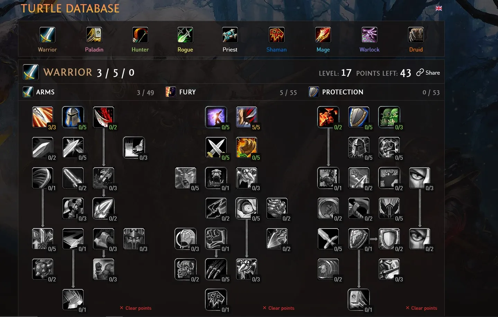
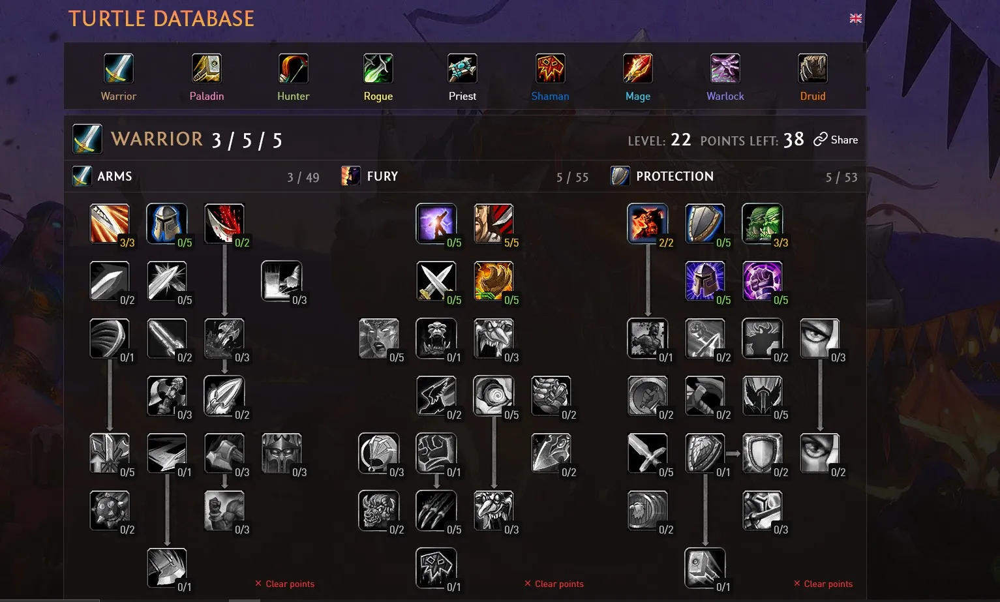
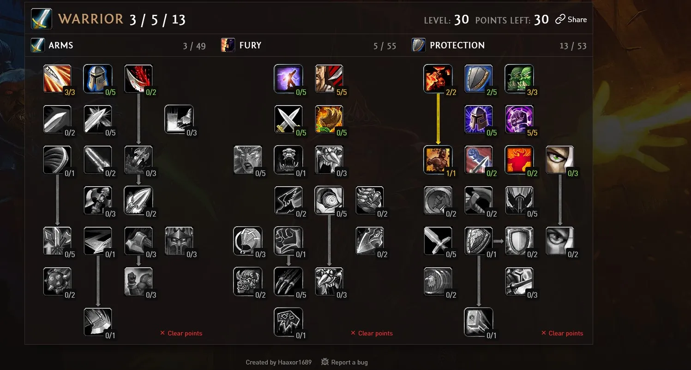
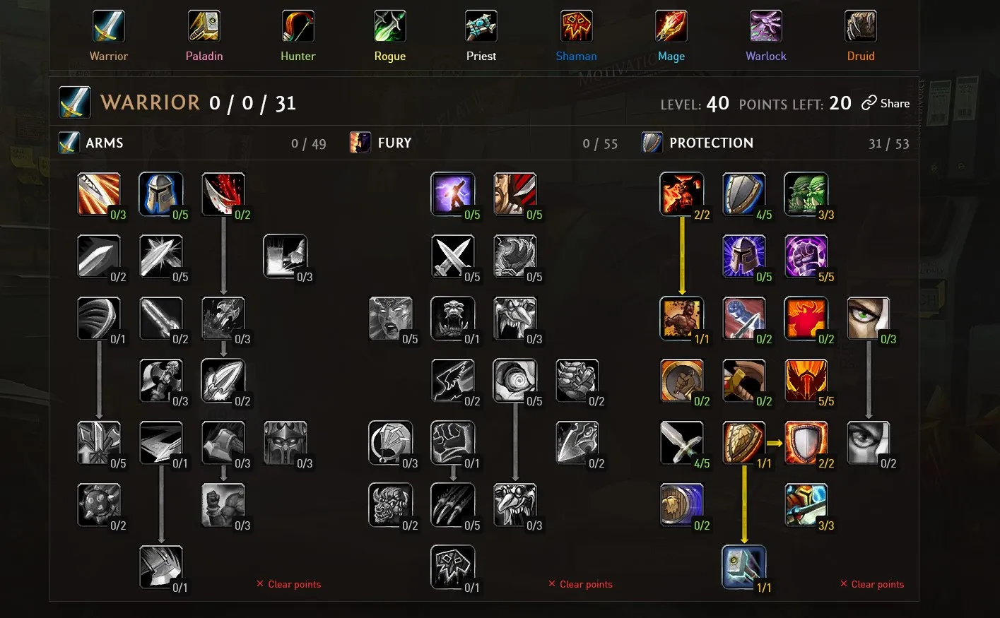
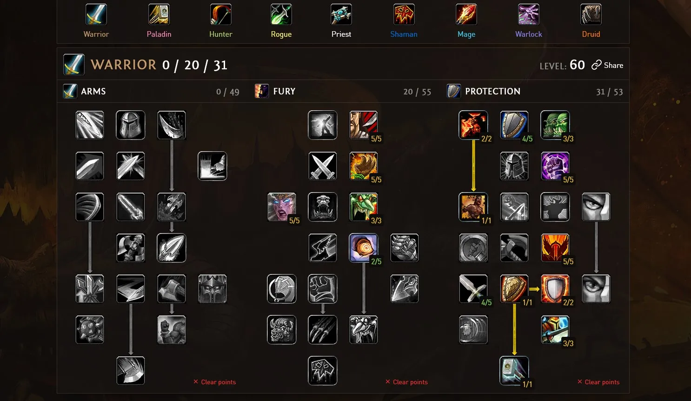

# 🛡️ Warrior Leveling Guide – Turtle WoW

> Safe. Efficient. Dungeon-Ready. Nearly Unkillable.

---

## 📑 Table of Contents

- [Overview](#-overview)
- [Early Levels 1–20](#-early-levels-120)
- [Rush Last Stand](#-rush-last-stand)
- [Level 30 Full Respec](#-level-30-full-respec)
- [Level 30–40 Progression](#-level-3040-progression)
- [Dungeon Tanking Strategy](#-dungeon-tanking-strategy)
- [Post-40 Fury Scaling](#-post40-fury-scaling)
- [Level-60](#-Level-60)
- [Talent Order Table](#-talent-order-table)
- [Image Structure](#-image-structure)

---

# 📌 Overview

This leveling build focuses on:

- Rage efficiency
- Survivability
- Dungeon threat control
- Smooth power spikes (especially at 30)

You are extremely durable while maintaining strong damage uptime.

---

# 🗡️ Early Levels (1–20)

**Goal:** Reduce Heroic Strike rage cost and increase crit chance.

### Why this works:
- Early Sunder Armor is weak and inefficient.
- Rage efficiency matters more than armor reduction.
- 5/5 Cruelty gives consistent damage smoothing.

### Priority:
- Reduce Heroic Strike cost
- 5/5 Cruelty (crit)

---

<strong>💡 Early Level Gameplay Tips</strong>

- Pull 2–3 mobs safely.
- Use Defensive Stance when needed.
- Keep Shield Block active when tanking.
- Avoid rage dumping inefficiently.

---

# 🛡️ Rush Last Stand

Rush **Last Stand** in the Protection tree.

### Why?
- Free health potion every 10 minutes.
- Saves dungeon wipes.
- Allows aggressive pulls.
- Great for elite quests.

You become extremely hard to kill.

---

# 🔁 Level 30 – Full Respec

At **Level 30**, do a full respec.

### Rush Shield Bash ASAP.

Why this is massive:
- Huge damage spike
- Reliable interrupt
- Efficient rage usage
- Feels like a 4x damage increase

> ⚠ Always train the highest Shield Bash rank immediately.

---

# 🧱 Level 30–40 Progression

After Shield Bash:

### 1️⃣ Unlock Concussion Blow (40)
- Free stun
- Excellent control
- Strong dungeon utility

### 2️⃣ Max Shield Block (5/5)
- Rage per block
- Scales extremely well in dungeons
- Strong defensive synergy

---

# 🗡️ Dungeon Tanking Strategy

Take **Defensive Tactics** for strong threat generation.

### Result:
- Stable aggro
- High survivability
- Reliable multi-pack tanking
- Can play aggressively without losing control

You are now a dungeon anchor.

---

<strong>⚔ Suggested Basic Tank Rotation</strong>

1. Bloodrage pre-pull  
2. Shield Block  
3. Shield Bash  
4. Revenge  
5. Heroic Strike dump  
6. Concussion Blow on dangerous mobs  

Maintain rage control and interrupt key casts.

---

# ⚡ Post-40 Fury Scaling

After core Protection talents:

Move into **Fury tree** for:

- Crit scaling
- Rage generation
- Passive health regeneration

This gives:
- Faster solo kill speed
- Better sustain
- Smooth scaling into endgame

---

# ⚡ Level-60

---

# 📊 Talent Order Table

| Level Range | Focus | Key Talents |
|------------|-------|------------|
| 10–20 | Rage Efficiency | Heroic Strike cost reduction |
| 15–20 | Damage | 5/5 Cruelty |
| 20–30 | Survivability | Rush Last Stand |
| 30 | Full Respec | Shield Bash |
| 30–40 | Control | Concussion Blow |
| 35–45 | Rage Scaling | 5/5 Shield Block |
| 40+ | Damage Scaling | Fury tree |

---

# ✅ Why This Build Is Strong

✔ Extremely safe  
✔ High dungeon value  
✔ Smooth rage economy  
✔ Strong interrupts  
✔ Stuns on demand  
✔ Scales into endgame  

---

> You are nearly unkillable while leveling.  
> Level 30 is your true power spike.

---
